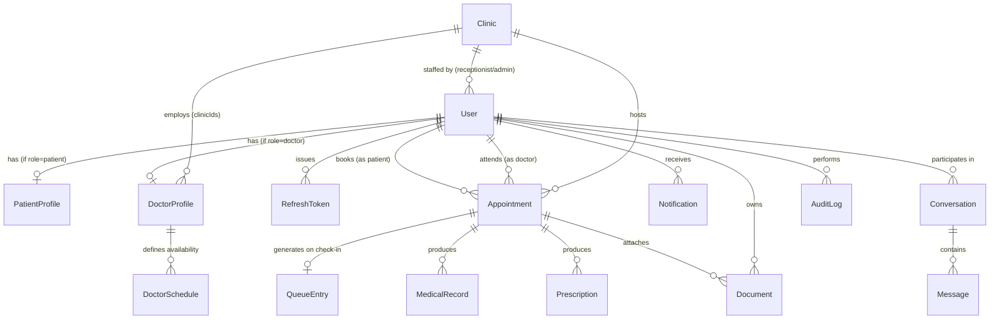

# HealthCare Connect — Backend Project Plan

Status baseline (as of this doc): turborepo scaffolded, `apps/backend` has Express 5 + Mongoose skeleton (`app.ts`, `server.ts`, `config/env.ts`, `config/db.ts`, empty `models/` `controllers/` folders), `apps/web` is default Next.js, `packages/types` is empty. Nothing else built yet. This plan starts from there.

## 1. Architecture decision: modular monolith first

The tech stack lists gRPC + SQS for inter-service communication, which implies microservices. Building real separate services before a single domain model has stabilized is premature — it multiplies deployment/debugging cost for no benefit yet. Recommendation:

- **Now:** build `apps/backend` as one Express service, but organize code as **domain modules** with hard boundaries (no cross-module reach-into-internals; only import another module's public `service` functions or emit events). This is the same shape a NestJS app or a service-oriented split would have internally.
- **Later (Phase 10+):** once specific modules need independent scaling (e.g. notifications under heavy fan-out, or appointment booking needing isolation), extract them into standalone services and replace in-process calls with gRPC, and fire-and-forget calls with SQS. Because the module boundary already exists, this becomes a mechanical extraction instead of a rewrite.

This also means: don't build gRPC/SQS plumbing in Phase 1. Build the module boundaries correctly so extraction is cheap later.

## 2. Module list (15 domain modules)

| # | Module | Owns |
|---|--------|------|
| 1 | `auth` | login/register, JWT issuance, refresh rotation, password reset |
| 2 | `user` | base `User` account, RBAC role, profile common fields |
| 3 | `patient` | `PatientProfile` |
| 4 | `doctor` | `DoctorProfile`, verification by admin |
| 5 | `clinic` | `Clinic`, staff assignment |
| 6 | `schedule` | `DoctorSchedule` (recurring availability + exceptions), slot generation |
| 7 | `appointment` | `Appointment` booking, cancel/reschedule, double-booking prevention |
| 8 | `queue` | `QueueEntry`, live check-in queue per doctor/day |
| 9 | `medical-record` | `MedicalRecord` (diagnosis, vitals, notes) |
| 10 | `prescription` | `Prescription`, medicine list, PDF generation |
| 11 | `document` | `Document` — S3 upload metadata, CloudFront delivery |
| 12 | `notification` | `Notification` log, FCM + SNS dispatch |
| 13 | `chat` | `Conversation`, `Message` — patient/doctor messaging |
| 14 | `audit-log` | `AuditLog` — compliance trail for sensitive actions |
| — | `jobs` (cross-cutting, not a domain) | BullMQ queues/workers used by appointment/notification modules |
| — | `sockets` (cross-cutting) | Socket.IO server, room management, event emitters used by queue/appointment/chat |

15 data-owning modules is enough granularity to reason about without fragmenting a solo/small-team codebase. `RefreshToken` lives inside `auth`; it's listed separately in data modeling below because it's its own collection.

## 3. Data modeling

### 3.1 Entity relationship overview



Design choice: `User` is a single collection with a `role` discriminator (`patient | doctor | receptionist | admin | super_admin`), not five separate auth tables. `PatientProfile`/`DoctorProfile` hold role-specific fields, 1:1 with `User` via `userId`. Receptionist/Admin don't need a separate profile collection for MVP — `clinicId` lives directly on `User` for those roles. `super_admin` is your own platform team (not clinic staff) — no `clinicId`, sees across all clinics. This is standard **multi-tenancy**: one database, one codebase, every clinic-scoped query filtered by `clinicId` — a clinic admin's queries are automatically restricted to their own clinic's data, while `super_admin` queries aren't filtered at all. Adding more clinics never changes the schema, just adds more `Clinic`/`User` documents.

### 3.2 Collections and fields

#### `User`
| Field | Type | Notes |
|---|---|---|
| email | string, unique, lowercase | login identifier |
| phone | string, unique | |
| passwordHash | string | bcrypt/argon2 |
| role | enum: patient, doctor, receptionist, admin, super_admin | immutable after creation |
| fullName | string | |
| avatarDocumentId | ref `Document` | optional |
| clinicId | ref `Clinic` | required for receptionist/admin, null for patient/doctor/super_admin |
| isEmailVerified, isPhoneVerified | boolean | |
| isActive | boolean | soft-disable account |
| lastLoginAt | date | |
| timestamps | createdAt, updatedAt | |

Indexes: unique on `email`, unique on `phone`, index on `role`.

#### `RefreshToken`
| Field | Type | Notes |
|---|---|---|
| userId | ref User | |
| tokenHash | string | never store raw token |
| deviceInfo | { userAgent, ip } | |
| expiresAt | date | TTL index |
| revokedAt | date, nullable | set on logout/rotation |

Indexes: TTL index on `expiresAt`; index on `userId`.

#### `PatientProfile`
| Field | Type | Notes |
|---|---|---|
| userId | ref User, unique | |
| dob | date | |
| gender | enum | |
| bloodGroup | string | |
| address | { line1, city, state, zip, country } | |
| emergencyContact | { name, phone, relation } | |
| allergies | string[] | |
| chronicConditions | string[] | |
| insuranceInfo | { provider, policyNumber } | optional |

#### `DoctorProfile`
| Field | Type | Notes |
|---|---|---|
| userId | ref User, unique | |
| specializations | string[] | |
| qualifications | [{ degree, institution, year }] | |
| experienceYears | number | |
| registrationNumber | string | medical council reg no. |
| bio | string | |
| consultationFee | number | |
| clinicIds | ref Clinic[] | doctor may work at multiple clinics |
| languagesSpoken | string[] | |
| ratingAvg, ratingCount | number | |
| isVerified | boolean | admin-approved credentials |

#### `Clinic`
| Field | Type | Notes |
|---|---|---|
| name | string | |
| address | { line1, city, state, zip, country } | |
| phone, email | string | |
| operatingHours | [{ dayOfWeek, openTime, closeTime }] | |
| timezone | string | |
| isActive | boolean | |

#### `DoctorSchedule`
| Field | Type | Notes |
|---|---|---|
| doctorId | ref User | |
| clinicId | ref Clinic | |
| recurring | [{ dayOfWeek(0-6), startTime, endTime, slotDurationMinutes }] | weekly template |
| exceptions | [{ date, type: leave\|extra, startTime, endTime }] | holidays / one-off hours |
| effectiveFrom, effectiveTo | date | |

Indexes: compound `{ doctorId, clinicId }`. Available slots are **computed on read** from `recurring` + `exceptions` minus already-booked `Appointment`s for that date — not pre-materialized, to avoid a slot-explosion collection.

#### `Appointment` (core entity — see §4 for booking-safety design)
| Field | Type | Notes |
|---|---|---|
| patientId | ref User | |
| doctorId | ref User | |
| clinicId | ref Clinic | |
| slotStart, slotEnd | date | |
| status | enum: booked, confirmed, checked_in, in_progress, completed, cancelled, no_show, expired | |
| type | enum: in_person, video | |
| reasonForVisit | string | |
| bookedBy | ref User | patient self-booked or receptionist booked on behalf |
| checkInTime | date | |
| queueNumber | number | assigned at check-in |
| cancellationReason | string | |
| cancelledBy | ref User | |
| reminderSentAt | date | set by BullMQ reminder job, prevents duplicate sends |

Indexes (critical):
- **Unique partial index** on `{ doctorId: 1, slotStart: 1 }` filtered `{ status: { $in: ["booked","confirmed","checked_in","in_progress"] } }` — this is the DB-level guarantee against double-booking.
- `{ patientId: 1, slotStart: 1 }` — patient's appointment list.
- `{ clinicId: 1, doctorId: 1, slotStart: 1 }` — day/queue queries.

#### `QueueEntry`
| Field | Type | Notes |
|---|---|---|
| appointmentId | ref Appointment, unique | |
| doctorId, clinicId | ref | denormalized for fast queries |
| date | date (day only) | |
| position | number | |
| status | enum: waiting, called, in_consultation, done, skipped | |
| estimatedWaitMinutes | number | recomputed as queue moves |
| checkedInAt, calledAt, completedAt | date | |

Indexes: compound `{ doctorId, date, position }`.

#### `MedicalRecord`
| Field | Type | Notes |
|---|---|---|
| patientId, doctorId | ref User | |
| appointmentId | ref Appointment | |
| visitDate | date | |
| chiefComplaint | string | |
| symptoms | string[] | |
| vitals | { heightCm, weightKg, bloodPressure, temperature, pulse, spo2 } | |
| diagnosis | string[] | |
| notes | string | doctor's clinical notes |
| attachmentIds | ref Document[] | |

#### `Prescription`
| Field | Type | Notes |
|---|---|---|
| appointmentId | ref Appointment | |
| patientId, doctorId | ref User | |
| medicines | [{ name, dosage, frequency, durationDays, instructions }] | |
| notes | string | |
| pdfDocumentId | ref Document | generated PDF stored via S3 |
| issuedAt | date | |

#### `Document`
| Field | Type | Notes |
|---|---|---|
| ownerId | ref User | usually the patient |
| uploadedBy | ref User | |
| appointmentId | ref Appointment, optional | |
| type | enum: lab_report, prescription, scan, insurance, avatar, other | |
| s3Key | string | |
| cloudfrontUrl | string | signed/short-lived if sensitive |
| mimeType, sizeBytes, originalFilename | | |

#### `Notification`
| Field | Type | Notes |
|---|---|---|
| userId | ref User | recipient |
| title, body | string | |
| type | enum: appointment_reminder, appointment_confirmed, appointment_cancelled, follow_up, prescription_ready, system_alert | |
| channel | enum: push_fcm, sns, in_app | |
| relatedEntityType, relatedEntityId | string, ObjectId | polymorphic link |
| status | enum: pending, sent, failed, read | |
| sentAt, readAt | date | |

#### `Conversation`
| Field | Type | Notes |
|---|---|---|
| participantIds | ref User[] | typically [patient, doctor] |
| appointmentId | ref Appointment, optional | context |
| lastMessageAt | date | for inbox sorting |

#### `Message`
| Field | Type | Notes |
|---|---|---|
| conversationId | ref Conversation | |
| senderId | ref User | |
| content | string | |
| attachmentIds | ref Document[] | |
| readBy | [{ userId, readAt }] | |

Indexes: `{ conversationId, createdAt }`.

#### `AuditLog`
| Field | Type | Notes |
|---|---|---|
| actorId | ref User | |
| action | string | e.g. `appointment.cancel`, `prescription.create` |
| entityType, entityId | string, ObjectId | |
| metadata | mixed | before/after diff |
| ip, userAgent | string | |

Write to this on every state-changing action in `appointment`, `prescription`, `medical-record`, and auth events — healthcare data needs an accountability trail even without formal HIPAA scope.

## 4. Double-booking prevention (the trickiest requirement)

Two layers, both required:

1. **Redis distributed lock at request time** — before creating an appointment, acquire `SET lock:slot:{doctorId}:{slotStartISO} <requestId> NX PX 5000`. If acquisition fails, immediately return "slot no longer available" instead of hitting Mongo. This handles the common case cheaply and gives fast, friendly UX under contention.
2. **Mongo unique partial index as the source of truth** — described in §3.2 on `Appointment`. Even if two requests somehow both pass the lock (lock expiry race, multi-region edge case), the second `insertOne` throws `E11000 duplicate key`, which the service layer catches and converts into a "slot taken" response. This is what actually guarantees correctness — Redis is an optimization, Mongo's index is the guarantee.

Booking flow:
```
1. Validate slot against DoctorSchedule (within working hours, not in an exception/leave window)
2. Acquire Redis lock for (doctorId, slotStart)
3. Insert Appointment (status: booked) — rely on unique partial index
4. On success: release lock, emit socket event `appointment:created`, enqueue reminder job in BullMQ
5. On duplicate key error: release lock, return 409 Conflict
6. Always release lock in a finally block; also rely on PX TTL as a safety net if the process crashes
```

## 5. Real-time design (Socket.IO + Redis)

- Use `@socket.io/redis-adapter` from day one of the sockets module so horizontal scaling (multiple ECS tasks) works without code changes later.
- Auth: socket handshake carries the JWT access token; verify and attach `userId`/`role` to the socket.
- Rooms: `clinic:{clinicId}:queue`, `doctor:{doctorId}:queue`, `appointment:{appointmentId}`, `conversation:{conversationId}`.
- Events emitted by the backend: `queue:updated`, `appointment:statusChanged`, `chat:message`, `chat:typing`.
- The `queue` and `appointment` modules emit through a shared `sockets` module interface (e.g. `emitToClinic(clinicId, event, payload)`) — they never touch `io` directly, keeping the boundary clean for future service extraction.

## 6. Background jobs (BullMQ, Redis-backed)

| Queue | Trigger | Job |
|---|---|---|
| `appointment-reminder` | delayed job scheduled at booking time (fires N hours before `slotStart`) | send reminder notification |
| `follow-up-reminder` | enqueued when appointment marked `completed` (delay = N days) | prompt patient to book follow-up |
| `notification-dispatch` | enqueued by any module needing to notify a user | fan out to FCM push and/or SNS, write `Notification` record, retry with backoff on failure |
| `expired-appointment-cleanup` | repeatable cron (every 5 min) | find `status: booked` appointments past `slotStart + grace period` with no check-in, mark `expired`, free the slot |

Keep job **producers** inside the domain module that owns the trigger (e.g. `appointment.service.ts` enqueues to `appointment-reminder`), and job **processors/workers** in `src/jobs/`. This keeps business logic in one place and job plumbing in another.

## 7. File storage flow

`Multer` (memory storage, size/type limits) → validate → upload to `S3` under a key convention like `clinics/{clinicId}/patients/{patientId}/{documentType}/{uuid}.{ext}` → save `Document` metadata → serve via `CloudFront` with signed URLs for anything containing PHI (lab reports, prescriptions), short TTL (e.g. 5 min).

## 8. Auth & RBAC

- JWT access token (short-lived, ~15 min) + refresh token (long-lived, ~7-30 days, stored hashed in `RefreshToken`, rotated on every use, revocable).
- `rbac.middleware.ts` takes an allow-list of roles per route: `requireRole("doctor", "admin")`.
- Zod schemas validate every request body/query/params before it reaches a controller — one `validate.middleware.ts` wrapping a Zod schema per route.
- Permission shape (who can do what). `admin` is scoped to their own `clinicId` — every query they run is filtered `WHERE clinicId = <their clinic>`. `super_admin` has no `clinicId` and is not scoped to any single clinic — this is your own platform team, not clinic staff:

| Action | Patient | Doctor | Receptionist | Admin (own clinic) | Super Admin (platform) |
|---|---|---|---|---|---|
| Book/cancel own appointment | ✅ | — | ✅ (on behalf) | ✅ | — |
| View own medical records | ✅ | ✅ (their patients) | — | — | — |
| Write medical record / prescription | — | ✅ | — | — | — |
| Manage doctor schedule | — | ✅ (own) | — | ✅ (own clinic) | — |
| Manage clinic staff (add/remove doctors/receptionists) | — | — | — | ✅ (own clinic) | ✅ (any clinic) |
| Check patients into queue | — | — | ✅ | ✅ | — |
| View audit logs | — | — | — | ✅ (own clinic only) | ✅ (all clinics) |
| Approve/suspend a clinic registration | — | — | — | — | ✅ |
| View platform-wide analytics (all clinics) | — | — | — | — | ✅ |
| Create/remove clinic admins | — | — | — | — | ✅ |

Note admin and super_admin still **cannot** see medical records or prescriptions — that stays doctor + the patient themselves only, regardless of administrative privilege. This is the privacy boundary, not a permissions oversight.

## 9. Recommended `apps/backend/src` structure

```
src/
  config/          env.ts, db.ts, redis.ts, s3.ts, firebase.ts, socket.ts
  common/
    middleware/    auth.middleware.ts, rbac.middleware.ts, validate.middleware.ts,
                    error-handler.ts, not-found.ts
    utils/         jwt.util.ts, hash.util.ts, api-error.ts, api-response.ts, async-handler.ts
    constants/     roles.ts, appointment-status.ts
  modules/
    auth/          auth.controller.ts, auth.service.ts, auth.routes.ts, auth.validation.ts
    user/          user.model.ts, user.service.ts, ...
    patient/
    doctor/
    clinic/
    schedule/
    appointment/
    queue/
    medical-record/
    prescription/
    document/
    notification/
    chat/
    audit-log/
  jobs/            queues.ts (BullMQ queue defs), reminder.worker.ts, cleanup.worker.ts,
                    notification.worker.ts, index.ts (registers all workers)
  sockets/         socket.server.ts, queue.handler.ts, chat.handler.ts, appointment.handler.ts
  app.ts           (exists)
  server.ts        (exists)
```

Each module folder is self-contained: `*.model.ts` (Mongoose schema), `*.service.ts` (business logic, what other modules import), `*.controller.ts` (HTTP layer), `*.routes.ts`, `*.validation.ts` (Zod). Cross-module access only goes through `*.service.ts` exports — never import another module's model directly. This is what makes future gRPC extraction mechanical.

Use `packages/types` (currently empty) for shared TypeScript types/Zod schemas/DTOs consumed by both `apps/backend` and `apps/web`/`apps/admin` — e.g. `AppointmentStatus`, `UserRole`, request/response DTOs.

## 10. Phased roadmap

- **Phase 0 (done):** turborepo, Express + Mongoose skeleton, env config.
- **Phase 1 — Core infra:** Redis client, Zod validate middleware, standardized error/response helpers, request logging, `packages/types` scaffolding.
- **Phase 2 — Auth & RBAC:** `User`, `RefreshToken`, register/login, JWT issue+refresh+rotation, `rbac.middleware`.
- **Phase 3 — Profiles:** `PatientProfile`, `DoctorProfile`, `Clinic` CRUD, admin doctor-verification flow.
- **Phase 4 — Scheduling & booking:** `DoctorSchedule`, slot computation endpoint, `Appointment` create/cancel/reschedule with Redis lock + unique index (§4).
- **Phase 5 — Real-time:** Socket.IO server + Redis adapter, check-in → `QueueEntry`, live queue/appointment status broadcasts.
- **Phase 6 — Clinical data:** `MedicalRecord`, `Prescription` (+ PDF generation), `Document` upload via Multer → S3 → CloudFront.
- **Phase 7 — Notifications & jobs:** Firebase Admin (FCM), SNS, BullMQ queues from §6.
- **Phase 8 — Chat:** `Conversation`/`Message`, Socket.IO chat namespace, push-on-new-message.
- **Phase 9 — Audit trail:** `AuditLog` writes wired into appointment/prescription/medical-record/auth mutations.
- **Phase 10 — Service extraction (as/if needed):** gRPC contracts for appointment/patient/notification, SQS for async cross-service events — only once a module actually needs independent scaling.
- **Phase 11 — Deployment:** Dockerfile per app, docker-compose for local Mongo+Redis, Terraform (VPC, ECS Fargate, ALB, ECR, Route 53, ACM, IAM, Secrets Manager).

## 11. Env vars to plan for (grows per phase)

```
NODE_ENV, PORT, CORS_ORIGIN
MONGODB_URI
REDIS_URL
JWT_ACCESS_SECRET, JWT_ACCESS_TTL, JWT_REFRESH_SECRET, JWT_REFRESH_TTL
AWS_REGION, AWS_S3_BUCKET, AWS_CLOUDFRONT_DOMAIN, AWS_SNS_TOPIC_ARN
FIREBASE_PROJECT_ID, FIREBASE_CLIENT_EMAIL, FIREBASE_PRIVATE_KEY
```

Next concrete step: Phase 1 (Redis client + Zod validation middleware + shared error/response helpers), then Phase 2 (Auth/User/RBAC) — say the word and I'll start scaffolding it.
